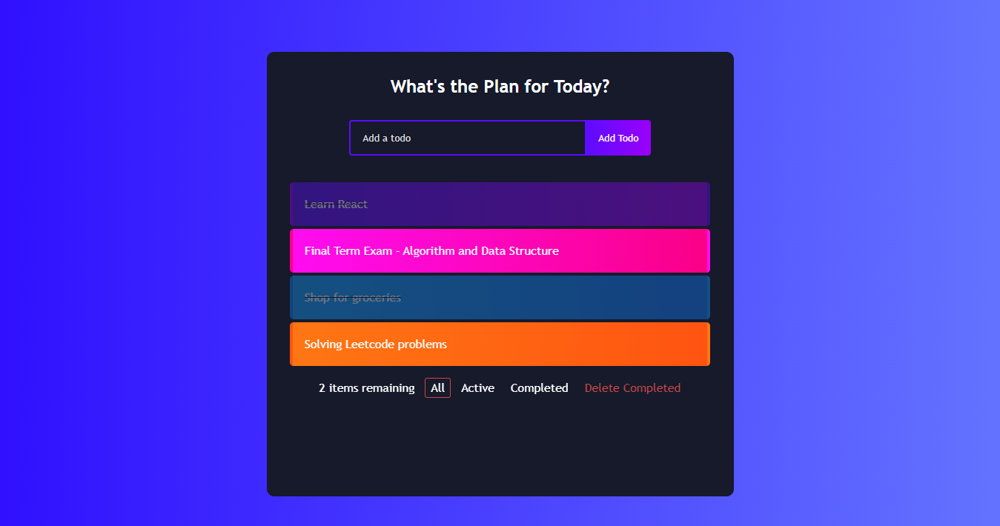

# Simple Todo App Project
A simple make-a-todo-list app, using **React** as the front-end framework and **NestJS** with REST API as the back-end framework. This project is built for my learning purpose to practice with building UI with React, establishing a REST API framework, and familiarizing myself to the web development workflow and design patterns.

    

## Features
- React as the front-end framework
- NestJS as the back-end framework with REST API and SQLite database integration via TypeORM
- Filters for all, active, and completed tasks
- Active tasks count
- Delete all completed tasks in one click
## Things to Consider / Improve
- Delete individual task
- Error handling (not present in current build)
- Timestamp of when the task is created and deadline of each task
-  Users and login (optional)
- Fetch data and store it locally when there's no connection to server
- Make it a PWA

## Deployment and Demo
TBA

## Learning Resources
* [React - The Complete Guide (from Academind via Udemy)](https://www.udemy.com/course/react-the-complete-guide-incl-redux/)
* [Full Modern React Tutorial Playlist (from The Net Ninja via YouTube)](https://www.youtube.com/playlist?list=PL4cUxeGkcC9gZD-Tvwfod2gaISzfRiP9d)
* [React Todo List App Tutorial (from Brian Design via YouTube)](https://www.youtube.com/watch?v=E1E08i2UJGI)
* [NestJS Official Documentation](https://docs.nestjs.com/)
* [NestJS Tutorial Playlist (from Marius Espejo via YouTube)](https://www.youtube.com/playlist?list=PLlaDAvA2MhR2jb8zavu6I-w1BA878aHcB)